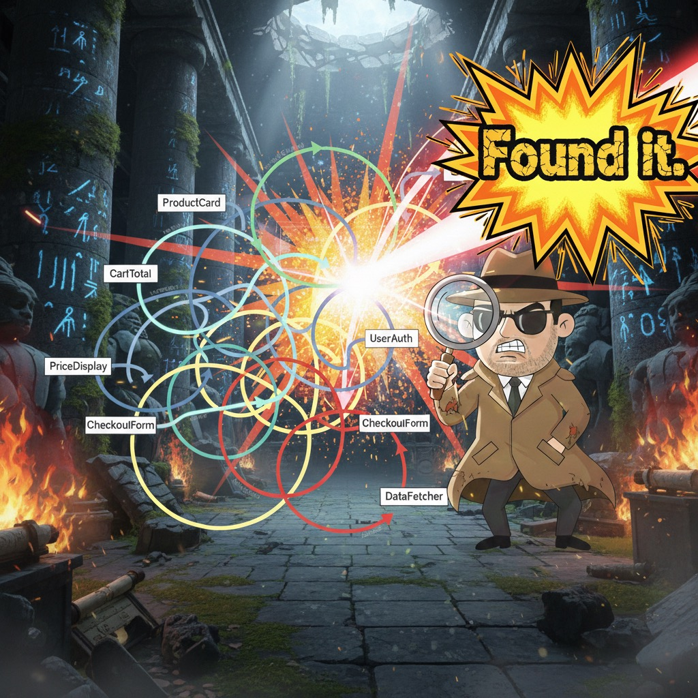

# @jantimon/react-render-loop-tracer



Find out which `useEffect` is calling which `setState` — and why your app re-renders 300 times on mount.

You open your Next.js app, hydration takes 2 seconds, and React DevTools shows 47 renders before the page is even interactive. You know some effect is setting state in a loop, but which one? In which component? You add `console.log`s, but there are 200 effects across 80 components. Good luck.

This tool instruments every `useEffect` and `useState` at build time and tells you exactly what's happening:

```
[state-change] useEffect PriceDisplay.tsx:42 in PriceDisplay changed useState "formattedPrice" because locale changed
[state-change] useEffect useCartTotal.ts:18 in CartDrawer changed useState "total" because items, formattedPrice changed
[state-change] useEffect CheckoutButton.tsx:9 in CheckoutButton changed useState "disabled" because total changed
```

Now you can see the cascade: a locale change reformats the price, which recalculates the cart total, which disables the checkout button. Three renders that didn't need to exist.

## Setup (Next.js)

```bash
npm install @jantimon/react-render-loop-tracer
```

```js
// next.config.mjs
import { withRenderLoopTracer } from "@jantimon/react-render-loop-tracer";

export default withRenderLoopTracer({
  // your existing Next.js config
});
```

Open your browser console and look for the output.

## How it works

A Babel plugin rewrites `useState`, `useReducer`, `useEffect`, and `useLayoutEffect` at build time, injecting file locations, component names, and dependency names. At runtime, a thin wrapper tracks which effect is currently executing and logs when `setState` or `dispatch` is called from inside one. No monkey-patching of React internals.

## What you'll see

**State changes from effects** — always logged:

```
[state-change] useEffect PriceDisplay.tsx:42 in PriceDisplay changed useState "formattedPrice" because locale changed
```

The reason tells you why the effect fired:

- `because it was initially mounted` — first render
- `because x, y changed` — specific deps that triggered it
- `because it re-ran (no deps changed detected)` — something is wrong, probably a missing or unstable dependency

**Slow effects** (≥8ms) get flagged as warnings even if they don't call setState:

```
[slow-effect] Slow effect: useEffect DataLoader.tsx:15 in DataLoader took 12ms
```

When the same effect fires multiple times, entries are counted per location — e.g. `[state-change] 1/3` means first of three from that effect.

## Long Task & INP grouping

When the browser's [Long Tasks API](https://developer.mozilla.org/en-US/docs/Web/API/PerformanceObserver) or [Event Timing API](https://developer.mozilla.org/en-US/docs/Web/API/PerformanceEventTiming) is available, logs are automatically grouped. Effects that don't call setState only appear inside these groups — this keeps your console clean.

```
▶ Long Task (150ms) — 3 effect→setState, 2 other effects
    [state-change] 1/2 useEffect PriceDisplay.tsx:42 in PriceDisplay changed useState "formattedPrice" because locale changed
    [state-change] 2/2 useEffect PriceDisplay.tsx:42 in PriceDisplay changed useState "currency" because locale changed
    [state-change] useEffect useCartTotal.ts:18 in CartDrawer changed useState "total" because items, formattedPrice changed
    [effect-run] useEffect Analytics.tsx:10 in Analytics ran because it was initially mounted
    [slow-effect] Slow effect: useEffect DataLoader.tsx:15 in DataLoader took 12ms
```

```
▶ Slow Interaction: click (320ms) — 1 effect→setState
```

Long tasks use a 50ms threshold. Slow interactions use 200ms, matching the [web.dev INP guidelines](https://web.dev/articles/inp). Groups are collapsible in devtools. Each entry type uses a different console level — `[state-change]` logs, `[effect-run]` infos, `[slow-effect]` warnings — so you can filter by severity in devtools.

## Custom logger

```js
globalThis.__effectTrackerLogger = (message) => {
  // send to your perf dashboard, filter, etc.
};
```

## License

MIT
